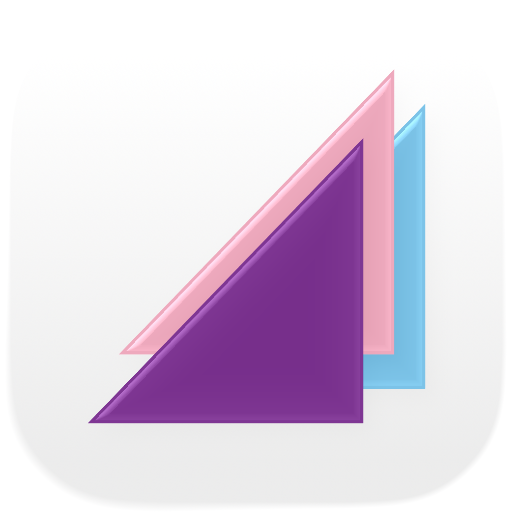

  

<h1 align="center">坂道ブログ</h1>

  乃木坂46・櫻坂46・日向坂46ファンのためのブログリーダー

  <a href="README.md">English</a> ・
  <a href="README_ko.md">한국어</a> ・
  <a href="README_zh-Hans.md">简体中文</a> ・
  <a href="README_zh-Hant.md">繁體中文</a>

---

## このアプリについて

**坂道ブログ**は、坂道シリーズ3グループの公式ブログを無料で読めるファンメイドアプリです。

- **乃木坂46**
- **櫻坂46**
- **日向坂46**

最新のブログ記事をチェックしたり、推しメンバーを見つけたり、お気に入りの記事を保存したり — すべてひとつのアプリで。

## 機能

- **ブログフィード** — 最新のブログ記事をカードレイアウトで一覧表示。プルダウンで更新、スクロールでさらに読み込み。
- **メンバープロフィール** — 生年月日・期別・出身地・血液型・星座・SNSリンクなどのメンバー情報を表示。
- **推し機能** — メンバーカードを長押しして「推し」に設定。推しメンバーは専用セクションからすぐにアクセス可能。
- **ブックマーク** — もう一度読みたい記事を保存。ブックマークした記事は一覧ページにまとめて表示。
- **メンバー検索** — 名前でリアルタイムにメンバーを検索。
- **グループ切り替え** — 乃木坂46・櫻坂46・日向坂46をワンタップで切り替え。
- **ダウンロード・エクスポート** — ブログの内容をデバイスに保存。キャッシュ済みの記事を画像付きHTMLファイルとしてエクスポート。
- **ダークモード** — ライト・ダーク・システム設定の3つのテーマに完全対応。
- **多言語対応** — 日本語・英語・韓国語・簡体字中国語・繁体字中国語に対応。

## 対応プラットフォーム

| プラットフォーム | 最低バージョン |
|-----------------|--------------|
| Android         | Android 5.0+ |
| iOS             | iOS 13.0+    |
| macOS           | macOS 10.15+ |
| Windows         | Windows 10+  |

## ダウンロード

[リリースページ](https://github.com/PythonShe/sakamichi_blog_reader-releases/releases)から最新版をダウンロードできます。

## プライバシー

坂道ブログは**ローカルファースト**設計です。閲覧履歴・ブックマーク・設定など、すべてのデータはお使いのデバイスにのみ保存されます。個人情報を外部サーバーに収集・保存・送信することは一切ありません。ブログの取得は、ウェブブラウザと同様に公式サイトへ直接アクセスして行います。

## 免責事項

本アプリはファンによる非公式プロジェクトです。乃木坂46・櫻坂46・日向坂46、およびそれらの運営会社とは**一切関係がありません**。表示されるブログの内容はすべて、各権利者に帰属します。

## お問い合わせ

- **開発者:** PythonShe
- **ウェブサイト:** https://sakamichi.zheng-she.com
- **サポート:** [GitHub Issues](https://github.com/PythonShe/sakamichi_blog_reader-releases/issues)
- **メール:** dev@zheng-she.com
